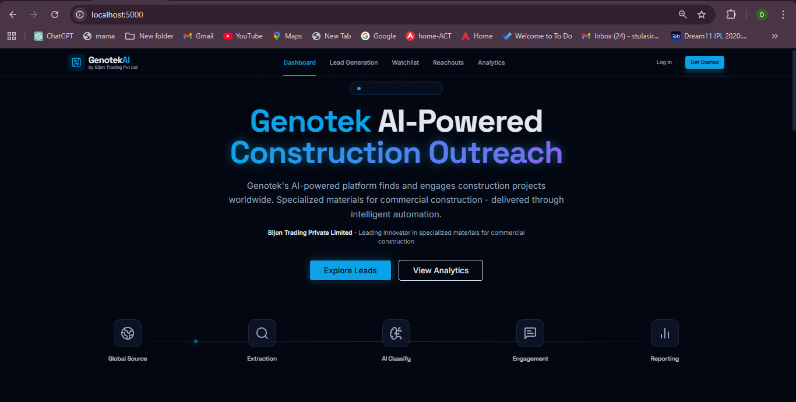
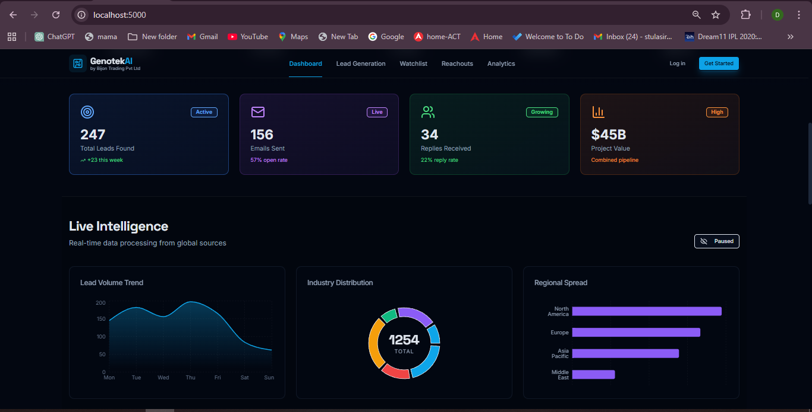
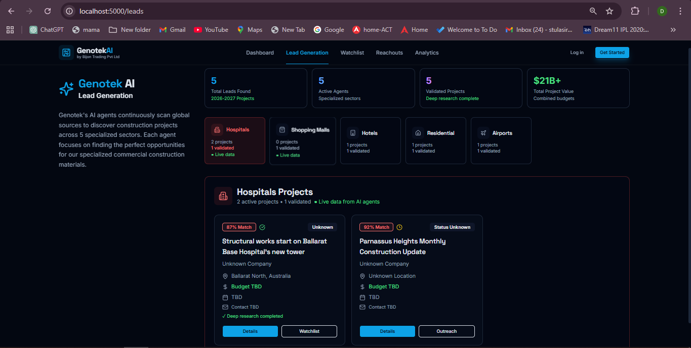
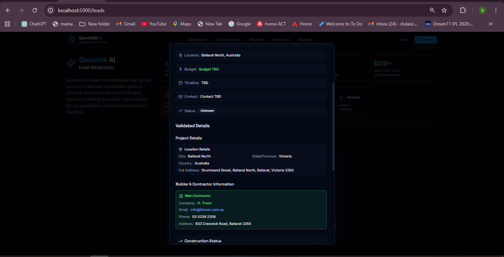
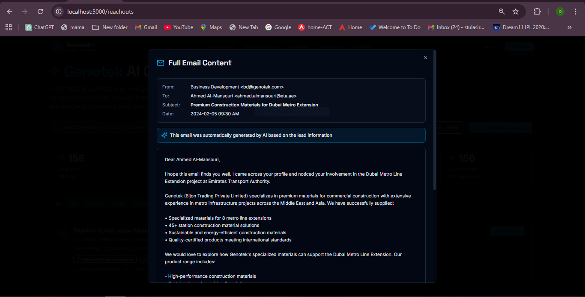
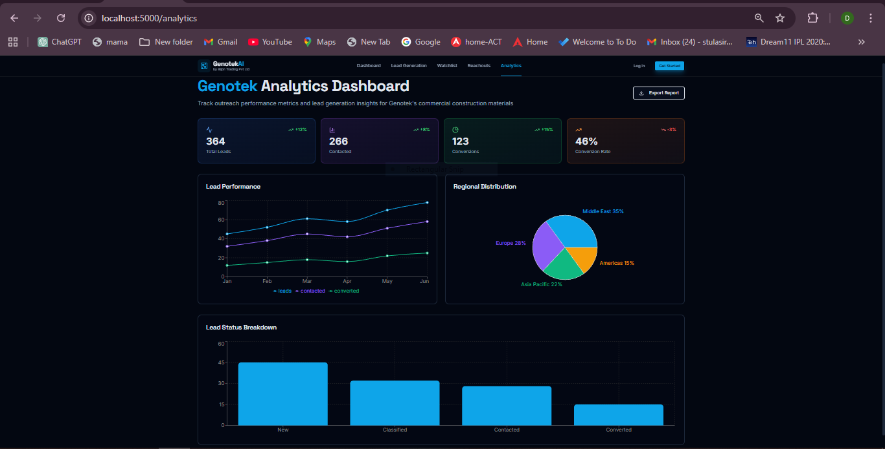
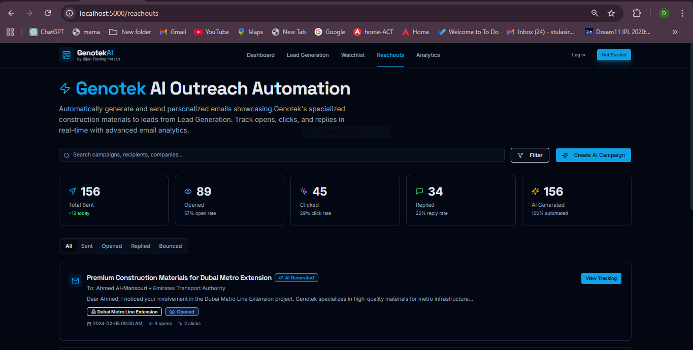

# 🏗️ Genotek AI - Automated Lead Generation Platform

**AI-Powered Lead Discovery for Construction Material Sales**

Genotek AI is an intelligent lead generation platform that automatically discovers, validates, and tracks construction projects worldwide. Built for **Bijon Trading Private Limited (Genotek)**, a specialized supplier of commercial construction materials.

## 🎥 Demo Video

**Watch the platform in action:** [View Demo Video](https://drive.google.com/file/d/1L91agFZ-EVGc4NKcMZX6yZp2JXFIuUcI/view?usp=sharing)



---

## 🎯 What Does It Do?

Genotek AI uses **specialized AI agents** to continuously scan the internet for construction projects across 5 key sectors:

- 🏥 **Hospitals** - Healthcare facilities and medical centers
- 🛍️ **Shopping Malls** - Retail and mixed-use developments
- 🏨 **Hotels** - Hospitality and resort projects
- 🏘️ **Residential** - High-rise apartments and housing estates
- ✈️ **Airports** - Aviation infrastructure and terminals

Each agent automatically:
1. **Searches** for new construction projects (2026-2027)
2. **Extracts** project details using AI
3. **Validates** information with deep research
4. **Finds** contractor contact details
5. **Updates** the dashboard in real-time

---

## ✨ Key Features

### 🤖 AI-Powered Agents
- **5 Specialized Agents** - Each focused on a specific construction sector
- **Automated Search** - Continuously scans global sources using SerperDev API
- **Smart Extraction** - Uses Groq LLM (Llama 3.1) to extract project details
- **Deep Validation** - Performs 15+ searches per project to verify information

### 📊 Real-Time Dashboard


- Live project statistics
- Active lead monitoring
- Industry breakdown
- Regional distribution
- Real-time updates every 5 seconds

### 🎯 Lead Generation


- Browse projects by category
- Filter by validation status
- View detailed project information
- Priority-based sorting
- Export capabilities

### 📋 Detailed Project Information


Each project includes:
- **Project Name & Location** - Full address and coordinates
- **Contractor Details** - Company name, email, phone, website
- **Financial Information** - Budget and investment details
- **Timeline** - Start date, completion date, current phase
- **Specifications** - Area, floors, capacity, departments
- **Material Opportunities** - Relevant products for Genotek

### 👁️ Hospital Watchlist
- Dedicated monitoring for validated hospital projects
- Priority filtering (HIGH/MEDIUM/LOW)
- Complete contractor contact information
- Material opportunity mapping
- Automatic updates when new projects are validated

### 📧 Automated Outreach


- AI-generated personalized emails
- Sent on behalf of Genotek
- Highlights relevant construction materials
- Professional templates
- Track engagement

### 📈 Analytics Dashboard


- Project statistics by industry
- Regional distribution maps
- Daily lead generation trends
- Success metrics
- ROI tracking

### 📬 Reachouts Management


- Track all outreach activities
- Email status monitoring
- Response tracking
- Follow-up scheduling
- Engagement analytics

---

## 🏗️ How It Works

### The Agent System

```
┌─────────────────────────────────────────────────────────────┐
│                    AI AGENT WORKFLOW                         │
└─────────────────────────────────────────────────────────────┘

1. SEARCH PHASE (agent.py)
   ├─ Agent performs 5 targeted searches
   ├─ Filters for 2026-2027 projects only
   ├─ Excludes completed projects
   └─ Saves top 2 results → initial_data.json

2. VALIDATION PHASE (final_validator.py)
   ├─ Deep research with 15+ searches
   ├─ Extracts contractor contact details
   ├─ Finds project location (City, Country)
   ├─ Validates construction status
   ├─ Identifies material opportunities
   └─ Saves validated data → final_data.json

3. WATCHLIST PHASE (auto_watchlist.py)
   ├─ Monitors final_data.json for changes
   ├─ Auto-updates watchlist every 10 seconds
   ├─ Categorizes by priority (HIGH/MEDIUM/LOW)
   └─ Saves to watchlist_data.json

4. FRONTEND DISPLAY
   ├─ API polls data every 5 seconds
   ├─ Updates dashboard automatically
   └─ Shows new projects within 5-15 seconds
```

### Agent Architecture

Each of the 5 agents has the same structure:

```
backend/agents/[agent_type]_agent/
├── agent.py              # Searches for projects
├── final_validator.py    # Validates and enriches data
├── watchlist.py          # Manages watchlist
├── auto_watchlist.py     # Auto-monitoring script
├── web_tool.py           # Search utilities
├── initial_data.json     # Raw search results
├── final_data.json       # Validated projects
└── watchlist_data.json   # Watchlist data
```

---

## 🚀 Quick Start

### Prerequisites

- **Python 3.8+**
- **Node.js 16+**
- **SerperDev API Key** - [Get free key](https://serper.dev/)
- **Groq API Key** - [Get free key](https://console.groq.com/)

### Installation

1. **Clone the repository**
   ```bash
   git clone https://github.com/yourusername/genotek-ai.git
   cd genotek-ai
   ```

2. **Install Python dependencies**
   ```bash
   pip install -r backend/requirements.txt
   ```

3. **Install Node.js dependencies**
   ```bash
   cd frontend
   npm install
   ```

4. **Configure API keys**
   ```bash
   # Copy the example config
   cp backend/config.example.py backend/config.py
   
   # Edit config.py and add your API keys:
   SERPER_API_KEY = "your_serper_api_key_here"
   GROQ_API_KEY = "your_groq_api_key_here"
   ```

### Running the Application

1. **Start the frontend server**
   ```bash
   cd frontend
   npm run dev
   ```
   Open http://localhost:5000 in your browser

2. **Start the auto-monitor (optional but recommended)**
   ```bash
   # In a new terminal
   cd backend/agents/hospitals_agent
   python auto_watchlist.py --monitor
   ```

3. **Run agents to find projects**
   ```bash
   # Find hospital projects
   python backend/agents/hospitals_agent/agent.py
   
   # Validate hospital projects
   python backend/agents/hospitals_agent/final_validator.py
   
   # Watch the dashboard update automatically!
   ```

---

## 📖 Usage Guide

### Finding New Projects

**Step 1: Run the Agent**
```bash
python backend/agents/hospitals_agent/agent.py
```
This searches for hospital construction projects and saves results to `initial_data.json`

**Step 2: Validate Projects**
```bash
python backend/agents/hospitals_agent/final_validator.py
```
This performs deep research and saves validated data to `final_data.json`

**Step 3: View in Dashboard**
- Open http://localhost:5000/leads
- New projects appear automatically within 5-15 seconds
- Click on any project to see full details

### Using the Watchlist

1. Navigate to http://localhost:5000/watchlist
2. View all validated hospital projects
3. Filter by priority (HIGH/MEDIUM/LOW)
4. Click "View Details" for complete information
5. Use "Contact" button to initiate outreach

### Automated Monitoring

Keep the auto-monitor running to get real-time updates:

```bash
python backend/agents/hospitals_agent/auto_watchlist.py --monitor
```

This will:
- Check for changes every 10 seconds
- Automatically update the watchlist
- Make new projects visible in the frontend within 5-15 seconds

---

## 🎨 Screenshots

### Dashboard

*Real-time overview of all leads and statistics*

### Lead Generation

*Browse and filter projects by category*

### Project Details

*Complete project information with contractor details*

### Email Outreach

*AI-generated personalized outreach emails*

### Analytics

*Comprehensive analytics and insights*

### Reachouts

*Track all outreach activities and responses*

---

## 🔧 Configuration

### API Keys

Edit `backend/config.py`:

```python
# SerperDev API (for web searches)
SERPER_API_KEY = "your_key_here"

# Groq API (for AI processing)
GROQ_API_KEY = "your_key_here"

# LLM Model
LLM_MODEL = "llama-3.1-8b-instant"
```

### Agent Settings

```python
# Number of searches per agent run
AGENT_SEARCH_QUERIES = 5

# Number of results to process
TOP_RESULTS_TO_PROCESS = 2

# Validation settings
VALIDATION_SEARCHES_PER_FIELD = 2
VALIDATION_BATCH_SIZE = 8
MIN_SEARCH_ATTEMPTS = 2
MAX_SEARCH_ATTEMPTS = 3
```

### Real-Time Updates

```python
# Backend monitoring interval
WATCHLIST_CHECK_INTERVAL = 10  # seconds

# Frontend refresh interval
FRONTEND_REFRESH_INTERVAL = 5000  # milliseconds
```

---

## 📁 Project Structure

```
genotek-ai/
├── backend/
│   ├── agents/
│   │   ├── hospitals_agent/
│   │   │   ├── agent.py              # Search for projects
│   │   │   ├── final_validator.py    # Validate projects
│   │   │   ├── watchlist.py          # Manage watchlist
│   │   │   ├── auto_watchlist.py     # Auto-monitoring
│   │   │   └── web_tool.py           # Search utilities
│   │   ├── shopping_malls_agent/     # Same structure
│   │   ├── hotels_agent/             # Same structure
│   │   ├── residential_agent/        # Same structure
│   │   └── airports_agent/           # Same structure
│   ├── config.py                     # API keys (not in git)
│   └── requirements.txt              # Python dependencies
├── frontend/
│   ├── client/src/
│   │   ├── pages/
│   │   │   ├── Dashboard.tsx         # Main dashboard
│   │   │   ├── LeadGeneration.tsx    # Lead browsing
│   │   │   ├── Watchlist.tsx         # Hospital watchlist
│   │   │   ├── Analytics.tsx         # Statistics
│   │   │   └── Reachouts.tsx         # Outreach tracking
│   │   └── hooks/
│   │       ├── use-agent-data.ts     # Agent data fetching
│   │       └── use-watchlist.ts      # Watchlist data
│   └── server/
│       └── routes.ts                 # API endpoints
├── images/                           # Screenshots
├── .gitignore                        # Git ignore rules
├── README.md                         # This file
└── CONTRIBUTING.md                   # Contribution guide
```

---

## 🤖 The AI Agents

### Hospital Agent
- Searches for hospital construction projects
- Focuses on healthcare facilities and medical centers
- Extracts bed capacity, departments, and medical specifications
- Identifies opportunities for medical-grade materials

### Shopping Mall Agent
- Finds retail and mixed-use developments
- Extracts tenant information and retail space details
- Identifies flooring and finishing material opportunities

### Hotel Agent
- Discovers hospitality and resort projects
- Extracts room count and amenity details
- Identifies luxury material opportunities

### Residential Agent
- Finds high-rise apartments and housing estates
- Extracts unit count and residential specifications
- Identifies bulk material opportunities

### Airport Agent
- Discovers aviation infrastructure projects
- Extracts terminal and runway specifications
- Identifies large-scale material opportunities

---

## 🔄 Real-Time Updates

The system provides near real-time updates:

```
Validation completes → final_data.json updated
         ↓ (0-10 seconds)
Monitor detects change
         ↓ (2 seconds)
Watchlist updated
         ↓ (0-5 seconds)
Frontend refreshes
         ↓
User sees update! 🎉

Total Delay: 5-15 seconds
```

---

## 🛠️ Technology Stack

### Backend
- **Python 3.8+** - Core language
- **LangChain** - LLM framework
- **Groq** - Fast LLM inference (Llama 3.1)
- **SerperDev** - Web search API

### Frontend
- **React 18** - UI framework
- **TypeScript** - Type safety
- **Vite** - Build tool
- **TanStack Query** - Data fetching
- **Shadcn/ui** - UI components
- **Tailwind CSS** - Styling
- **Framer Motion** - Animations

### APIs
- **SerperDev API** - Google search results
- **Groq API** - LLM processing (Llama 3.1-8b-instant)

---

## 📊 Data Flow

```
1. User runs agent.py
   ↓
2. Agent searches SerperDev API
   ↓
3. Results processed by Groq LLM
   ↓
4. Saved to initial_data.json
   ↓
5. User runs final_validator.py
   ↓
6. Deep validation with 15+ searches
   ↓
7. Saved to final_data.json
   ↓
8. Auto-monitor detects change
   ↓
9. Watchlist updated
   ↓
10. Frontend polls API
   ↓
11. Dashboard updates automatically
```

---

## 🔐 Security

- ✅ API keys stored in `config.py` (gitignored)
- ✅ Environment variables for sensitive data
- ✅ No credentials in version control
- ✅ Rate limiting on API calls
- ✅ Input validation on all endpoints

---

## 📝 License

This project is proprietary software owned by **Bijon Trading Private Limited (Genotek)**.

---

## 🏢 About Genotek

**Bijon Trading Private Limited (Genotek)** is a specialized supplier of commercial construction materials, serving major construction projects across multiple sectors including hospitals, shopping malls, hotels, residential complexes, and airports.

---

## 📞 Support

For questions or support:
- **Email**: support@genotek.com
- **Website**: www.genotek.com

---

## 🙏 Acknowledgments

- **SerperDev** - Web search API
- **Groq** - Fast LLM inference
- **LangChain** - LLM framework
- **React** - Frontend framework
- **Shadcn/ui** - Beautiful UI components

---

**Built with ❤️ by Genotek (Bijon Trading Private Limited)**

*Specialized construction materials for commercial projects worldwide*
